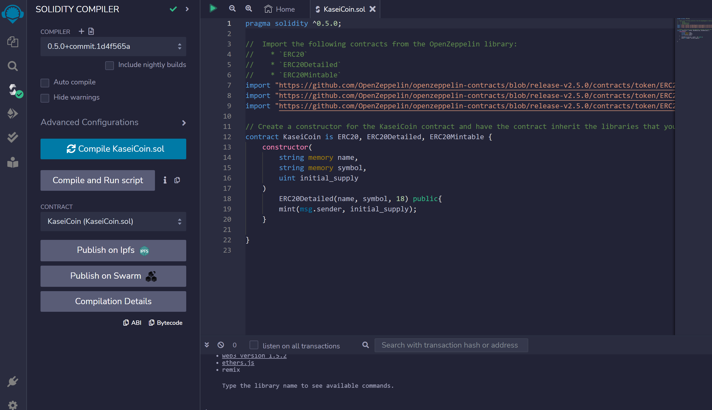
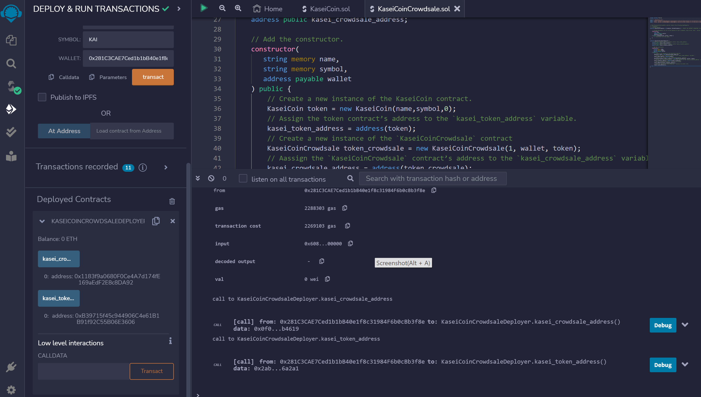
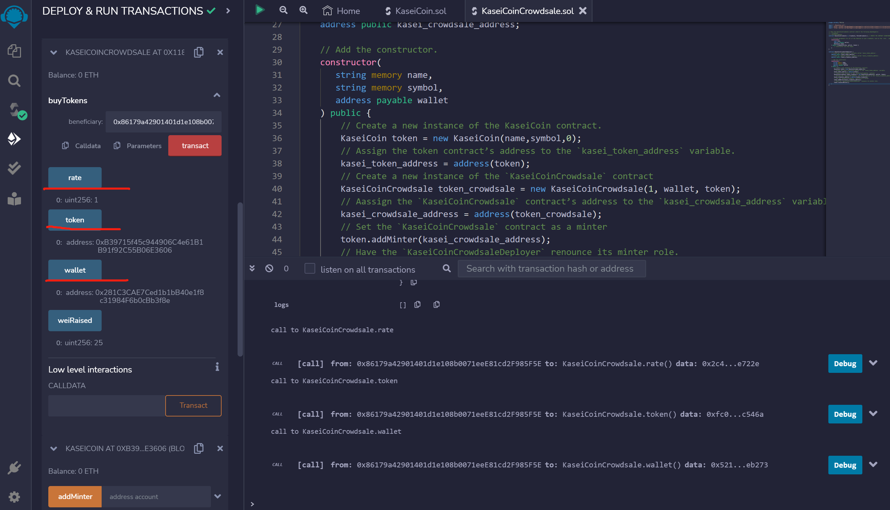
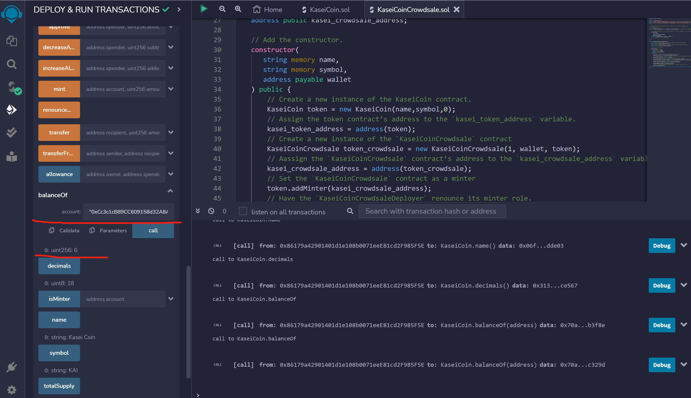

# Unit 21: Martian Token Crowdsale

## Background

After waiting for years and passing several tests, the Martian Aerospace Agency selected you to become part of the first human colony on Mars. As a prominent fintech professional, they chose you to lead a project developing a monetary system for the new Mars colony. You decided to base this new system on blockchain technology and to define a new cryptocurrency named **KaseiCoin**. (Kasei means Mars in Japanese.)

KaseiCoin will be a fungible token that is ERC-20 compliant. You will launch a crowdsale that will allow people who are moving to Mars to convert their earthling money to KaseiCoin.

## Steps on how to compile, deploy and test

## 1. Compile Results
1. Compile KaseiCoin.sol successfully

2. Compile KaseiCoinCrowdsale.sol successfully

3. Compile KaseiCoinCrowdsaleDeployer successfully

### 2. Prepare 3 accounts in metamask
Before deploying the contracts, make sure that you have launched Ganache and loaded at least three accounts into Remix.

1. __`Wallet address`__ (address from where the gas fee for deploying the smart contracts will be paid): 
- Account 10 in metamask

    `0x281C3CAE7Ced1b1bB40e1f8c31984F6b0cBb3f8e`

    initial balance = 100 ETH

2. __`Beneficiaries' addresses (purchasers' addresses)`__: 

- Account 11 in metamask

    `0xCc3c1cB89CC609158d32A8A0D26c020e3c7C329d`
    
    initial balance = 100 ETH

- Account 12 in metamask

    `0x86179a42901401d1e108b0071eeE81cd2F985F5E`
 
    initial balance = 100 ETH

Ganache Accounts Screen Shot: 

### 3. Deploy the KaseiCoinCrowdsaleDeployer, KaseiCoinCrowdsale, and KaseiCoin contracts.

To deploy the contracts, complete the following steps:
1. In the Remix IDE, navigate to the Deploy & Run Transactions pane, and then complete the following steps:
- Select an address from MetaMask (Account 10: 0x281C3CAE7Ced1b1bB40e1f8c31984F6b0cBb3f8e) that you will use to deploy the contracts. 
- Copy the address to the clipboard.
- Select the KaseiCoinCrowdsaleDeployer contract, and then fill in the values for Name and Symbol. Paste the address from the clipboard into the Wallet box.

- Click transact, and when the MetaMask dialog box opens, confirm the transaction.

2. Navigate to the Deployed Contracts section, and then open the box that is associated with the KaseiCoinCrowdsaleDeployer contract. Notice that buttons for `kasei_crowdsale_address` and `kasei_token_address` now appear.

`kasei_crowdsale_address`

    0x1183f9a0680F0Ce4A7d174fE169aEdF2E8c8DA92

`kasei_token_address`

    0xB39715f45c944906C4e61B1B91f92C55B06E3606

3. Link the contract that is associated with `kasei_crowdsale_address` to the `KaseiCoinCrowdsale` contract that you previously created by completing the following steps:
-  Copy the address that is associated with kasei_crowdsale_address.
-  Scroll up to the Contract box, and then select the compiled KaseiCoinCrowdsale.
-  Copy the address into the At Address box.
-  Click the At Address button.

4. Notice the deployed KaseiCoinCrowdsale contract in the Deployed Contracts section.

- The deployed KaseiCoinCrowdsale contract address is the same with `kasei_crowdsale_address`: 0x1183f9a0680F0Ce4A7d174fE169aEdF2E8c8DA92

5. Repeat the same process (step 3 and 4) with kasei_token_address and the KaseiCoin contract.

- Link the contract that is associated with `kasei_token_address` to the `KaseiCoin` contract that you previously created

-  Copy the address that is associated with kasei_token_address.
-  Scroll up to the Contract box, and then select the compiled KaseiCoin.
-  Copy the address into the At Address box.
-  Click the At Address button.

6. Notice the deployed KaseiCoin contract in the Deployed Contracts section.

- The deployed KaseiCoin contract address is the same with `kasei_token_address`: 0xB39715f45c944906C4e61B1B91f92C55B06E3606

### 4. Test the KaseiCoinCrowdsale
Now you will test the KaseiCoinCrowdsale. You will assume the role of a participant seeking to buy Kasei Coins. To do so, complete the following steps:
1. Purchase Kasei Coins from the crowdsale by completing the following steps:
- Select a new account from MetaMask. Notice the new account address in the Account box in the Remix IDE. Copy this account address to the clipboard.

Account 11 in metamask

0xCc3c1cB89CC609158d32A8A0D26c020e3c7C329d

- In the Value box, enter a value of wei to determine the number of tokens for this account to purchase.

- Navigate to the deployed KaseiCoinCrowdsale contract, paste the address into the buyTokens box, and then click the buyTokens button.

- When the MetaMask dialog box opens, click Confirm.

- Confirm that the number of purchased tokens is correctly reflected in Remix by clicking the totalSupply button.

2. Repeat the purchase process by using a third MetaMask address. Confirm that the total supply of tokens is correctly reflected in Remix by clicking the totalSupply button.

Purchase Kasei Coins from the crowdsale by completing the following steps:
- Select a new account from MetaMask. Notice the new account address in the Account box in the Remix IDE. Copy this account address to the clipboard.

Account 12 in metamask

0x86179a42901401d1e108b0071eeE81cd2F985F5E

- In the Value box, enter a value of wei to determine the number of tokens for this account to purchase.

- Navigate to the deployed KaseiCoinCrowdsale contract, paste the address into the buyTokens box, and then click the buyTokens button.

- When the MetaMask dialog box opens, click Confirm.

- Confirm that the number of purchased tokens is correctly reflected in Remix by clicking the totalSupply button.

3. Explore other functionality that is associated with this crowdsale application.  

Check rate, token address, wallet address info

Check account 11's balance using balancOf() function

Check account 12's balance using balancOf() function

Test isMinter() function using kasei_crowdsale_address

---

20-02-2023
