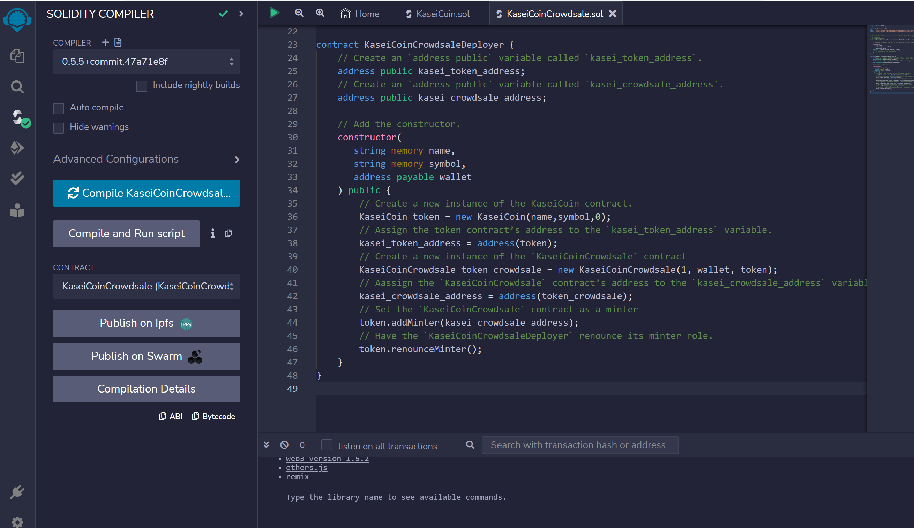

# Unit 21: Martian Token Crowdsale

## Background

After waiting for years and passing several tests, the Martian Aerospace Agency selected you to become part of the first human colony on Mars. As a prominent fintech professional, they chose you to lead a project developing a monetary system for the new Mars colony. You decided to base this new system on blockchain technology and to define a new cryptocurrency named **KaseiCoin**. (Kasei means Mars in Japanese.)

KaseiCoin will be a fungible token that is ERC-20 compliant. You will launch a crowdsale that will allow people who are moving to Mars to convert their earthling money to KaseiCoin.

# Parametres used in the project
1. Wallet address (address for the crowdsale smart contract to receive ETH): 
- Account 8 in metamask

    `0x9dd87756357582294869144b6E4161f36bf23feA`

2. Beneficiaries' addresses (purchasers' addresses): 

- Account 7 in metamask

    `0x58A853e2ed0BB05a89D402b4AaD50Cdc859aB0B5`

- Account 9 in metamask

    `0x08bA11A6d3E84DC01f8B69B40cEaB39d0E36e847`

# Steps of how to deploy and execute the code

You will deploy the KaseiCoinCrowdsaleDeployer, KaseiCoinCrowdsale, and KaseiCoin contracts.

Before deploying the contracts, make sure that you have launched Ganache and loaded at least three accounts into Remix.

To deploy the contracts, complete the following steps:
1. In the Remix IDE, navigate to the Deploy & Run Transactions pane, and then complete the following steps:
    - Select an address from MetaMask that you will use to deploy the contracts. (account 8 in metamask in the execution screenshots)
    `0x9dd87756357582294869144b6E4161f36bf23feA`
    - Copy the address to the clipboard.
    - Select the KaseiCoinCrowdsaleDeployer contract, and then fill in the values for Name and Symbol. Paste the address from the clipboard into the Wallet box.
    - Click transact, and when the MetaMask dialog box opens, confirm the transaction.
2. Navigate to the Deployed Contracts section, and then open the box that is associated with the KaseiCoinCrowdsaleDeployer contract. Notice that buttons for `kasei_crowdsale_address` and `kasei_token_address` now appear.
3. Link the contract that is associated with `kasei_crowdsale_address` to the `KaseiCoinCrowdsale` contract that you previously created by completing the following steps:
    -  Copy the address that is associated with kasei_crowdsale_address.
    -  Scroll up to the Contract box, and then select the compiled KaseiCoinCrowdsale.
    -  Copy the address into the At Address box.
    -  Click the At Address button.
4. Notice the deployed KaseiCoinCrowdsale contract in the Deployed Contracts section.
5. Repeat Steps 1 to 4 with kasei_token_address and the KaseiCoin contract.

Test the KaseiCoinCrowdsale
Now you will test the KaseiCoinCrowdsale. You will assume the role of a participant seeking to buy Kasei Coins. To do so, complete the following steps:
1. Purchase Kasei Coins from the crowdsale by completing the following steps:
    - Select a new account from MetaMask. Notice the new account address in the Account box in the Remix IDE. Copy this account address to the clipboard.
    - In the Value box, enter a value of wei to determine the number of tokens for this account to purchase.
    - Navigate to the deployed KaseiCoinCrowdsale contract, paste the address into the buyTokens box, and then click the buyTokens button.
    - When the MetaMask dialog box opens, click Confirm.
    - Confirm that the number of purchased tokens is correctly reflected in Remix by clicking the totalSupply button.
2. Repeat the purchase process by using a third MetaMask address. Confirm that the total supply of tokens is correctly reflected in Remix by clicking the totalSupply button.
3. Explore other functionality that is associated with this crowdsale application.  

# Steps and Execution Results
1. Compile KaseiCoin.sol successfully

2. Compile KaseiCoinCrowdsale.sol successfully

3. Compile KaseiCoinCrowdsaleDeployer successfully

4. Deploy KaseiCoinCrowdsaleDeployer

5. Navigate to the Deployed Contracts section, and then open the box that is associated with the KaseiCoinCrowdsaleDeployer contract. Notice that buttons for `kasei_crowdsale_address` and `kasei_token_address` now appear

    kasei_crowdsale_address

    `0xC33c62d2ce49F8BFdBf11F5427A84FBA4Ab0ED31`

    kasei_token_address

    `0xa8547DB9BB741a39399475E21A51a897B2095EF8`

6. Link the contract that is associated with `kasei_crowdsale_address` to the `KaseiCoinCrowdsale` contract that you previously created

-  Copy the address that is associated with kasei_crowdsale_address.
-  Scroll up to the Contract box, and then select the compiled KaseiCoinCrowdsale.
-  Copy the address into the At Address box.
-  Click the At Address button.

7. Repeat the same process (step 6) with kasei_token_address and the KaseiCoin contract.

Link the contract that is associated with `kasei_token_address` to the `KaseiCoin` contract that you previously created

-  Copy the address that is associated with kasei_token_address.
-  Scroll up to the Contract box, and then select the compiled KaseiCoin.
-  Copy the address into the At Address box.
-  Click the At Address button.

 

8.Test the KaseiCoinCrowdsale

Purchase Kasei Coins from the crowdsale by completing the following steps:
    - Select a new account from MetaMask. Notice the new account address in the Account box in the Remix IDE. Copy this account address to the clipboard.
    - In the Value box, enter a value of wei to determine the number of tokens for this account to purchase.

 

    - Navigate to the deployed KaseiCoinCrowdsale contract, paste the address into the buyTokens box, and then click the buyTokens button.

- Account 9 in metamask

    `0x08bA11A6d3E84DC01f8B69B40cEaB39d0E36e847`

 

    - When the MetaMask dialog box opens, click Confirm.

 

 

    
    - Confirm that the number of purchased tokens is correctly reflected in Remix by clicking the totalSupply button.

2. Repeat the purchase process by using a third MetaMask address. Confirm that the total supply of tokens is correctly reflected in Remix by clicking the totalSupply button.

 

- Account 9 in metamask

    `0x08bA11A6d3E84DC01f8B69B40cEaB39d0E36e847`

 

 

Buy token with 7 wei from account 7

    - Account 7 in metamask

    `0x58A853e2ed0BB05a89D402b4AaD50Cdc859aB0B5`

 

 

 

3. Explore other functionality that is associated with this crowdsale application.  

---

20-02-2023
